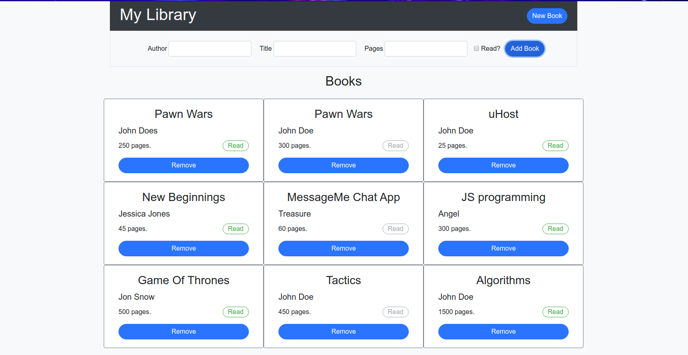

# Library

> This is a DOM library app where users can add new books, remove books and mark books as read.

## Built With

- JavaScript, HTML & CSS,
- Bootstrap 4

## Live Demo

[Live Demo Link](https://festive-lamarr-41f501.netlify.app)

## Getting Started

**This is an example of how you may give instructions on setting up your project locally.**
**Modify this file to match your project, remove sections that don't apply. For example: delete the testing section if the currect project doesn't require testing.**

To get a local copy up and running follow these simple example steps.

To get a local copy up and running follow these simple example steps.
- git clone git@github.com:trekab/library.git

Then you browse to the folder and exucute the following commands
- cd library
- double click on the index.html file to open the game in your browser.

## Authors

👤 **Treasure Kabareebe**

- Github: [@trekab](https://github.com/trekab)
- Twitter: [@TKabareebe](https://twitter.com/TKabareebe)
- Linkedin: [Treasure Kabareebe](https://www.linkedin.com/in/treasure-kabareebe/)

👤 **Angel Cordova** 

- Github: [@aecordova](https://github.com/aecordova) 
- Linkedin: [Angel Cordova](https://www.linkedin.com/in/ae-cordova/)

## 🤝 Contributing

Contributions, issues and feature requests are welcome!

Feel free to check the [issues page](issues/).

## Show your support

Give a ⭐️ if you like this project!

## Acknowledgments

- Hat tip to anyone whose code was used
- Inspiration
- etc

## 📝 License

This project is [MIT](lic.url) licensed.